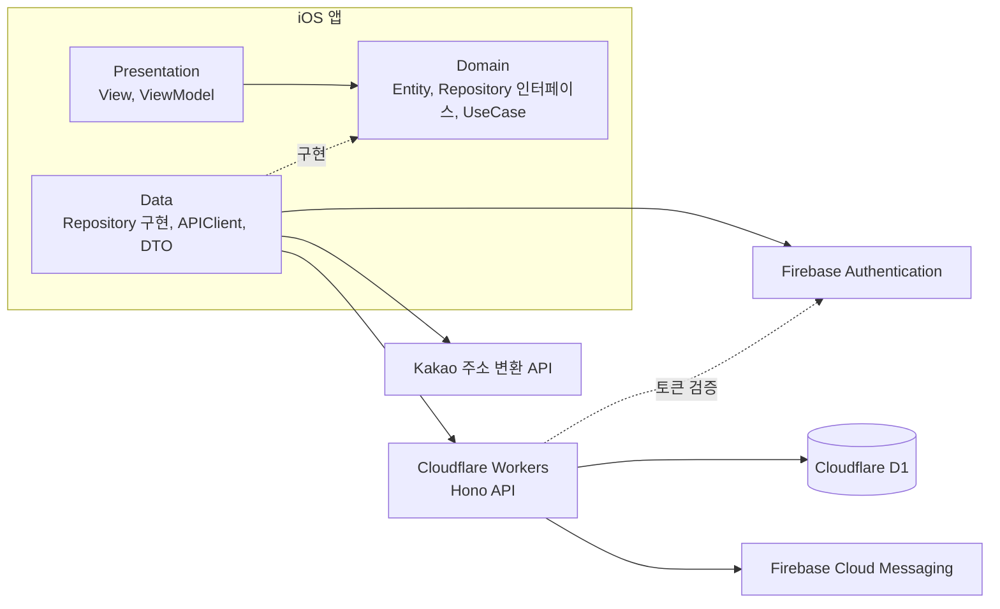
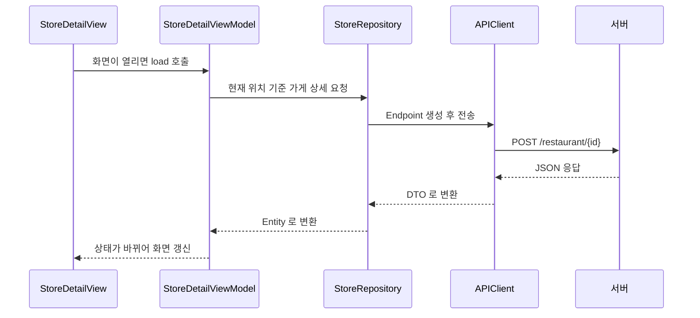

# WE-ON

결식 우려 아동이 아동급식카드로 이용할 수 있는 동네 식당을 찾고, 한 달 식비를 관리할 수 있는 iOS 앱이에요.
2023년에 UIKit 으로 만들었던 [드림머니](https://github.com/san5an3an/dreamMoney_app_UIKit)를 SwiftUI 로 다시 만들었고, 원본 서버가 사라져서 백엔드도 새로 만들었어요.

## 기술 스택

전체 기술 스택은 다음과 같아요.

| 구분 | 기술 스택 |
|---|---|
| 언어 | Swift 6, TypeScript |
| iOS UI | SwiftUI, Swift Charts, PhotosUI |
| 상태 관리와 비동기 | Observation(`@Observable`), Swift Concurrency(async/await, `async let`, TaskGroup, actor) |
| 네트워크 | URLSession, Codable |
| 인증과 푸시 | Firebase Authentication, Firebase Cloud Messaging (firebase-ios-sdk 12.19) |
| 지도와 위치 | 카카오맵 SDK(KakaoMapsSDK 2.12), Core Location, Kakao Local API |
| 이미지 | ImageIO |
| 서버 | Cloudflare Workers, Hono 4, Cloudflare D1(SQLite), jose |
| 테스트 | Swift Testing, XCTest(UI 테스트), Vitest, Cloudflare Workers Vitest 통합 |
| 빌드와 패키지 | XcodeGen, Swift Package Manager, npm, Wrangler |
| 최소 버전 | iOS 17.0 |

Combine, RxSwift, Alamofire, SnapKit 은 쓰지 않았어요. 원본은 RxSwift 와 Alamofire 를 썼는데, 이 앱의 비동기 작업은 대부분 요청 한 번에 응답 한 번이라 async/await 와 URLSession 만으로 충분했어요.

### iOS

| 기술 스택 | 적용 영역 | 선정 근거 |
|---|---|---|
| SwiftUI | 모든 화면과 공용 Component | 화면 상태가 바뀌면 자동으로 다시 그려져서 UIKit 보다 코드가 훨씬 짧아졌어요 |
| Observation | 모든 ViewModel 과 `SessionStore` | `@Observable` 은 실제로 읽은 값이 바뀔 때만 화면을 다시 그려서 ObservableObject 보다 가벼워요. 그래서 최소 버전을 iOS 17 로 정했어요 |
| Swift Concurrency | 서버 요청, 위치 조회, 권한 요청 | ViewModel 은 `@MainActor` 에서 돌리고, 기다릴 필요 없는 요청은 `async let` 으로 동시에 보내요. 위치는 TaskGroup 으로 5초 제한을 걸었고, FCM 토큰은 actor 에 보관해요 |
| Swift 6 엄격한 동시성 검사 | 프로젝트 전체 | 데이터 경합을 컴파일 단계에서 막으려고 켰고, 경고 없이 빌드돼요 |
| URLSession, Codable | `APIClient`, 요청과 응답 DTO | 외부 라이브러리 없이 async API 로 충분했어요. 서버 응답 DTO 와 앱 Entity 를 분리했어요 |
| Firebase Authentication | 회원가입, 이메일 인증, 로그인, 비밀번호 재설정, 탈퇴 | 원본 앱이 쓰던 인증 방식을 그대로 이어서 서버 API 와 맞췄어요. 서버에 보내는 ID 토큰도 여기서 받아요 |
| Firebase Cloud Messaging | 지출 기록 알림 | 서버가 매일 저녁 알림을 보낼 때 기기 토큰으로 써요. 알림 권한은 사용자가 알림을 켤 때만 물어요 |
| 카카오맵 SDK | 가게 위치 미리보기, 큰 지도, 가게 위치 마커 | 원본은 네이버 지도를 썼는데, 주소 검색에 쓰던 카카오 개발자 앱 하나로 지도 키까지 관리하려고 바꿨어요. SDK 가 UIKit 뷰만 제공해서 `UIViewRepresentable` 로 연결하고, 지도 엔진은 화면이 사라질 때 멈추게 했어요 |
| Core Location | 현재 위치 | iOS 17 의 `CLLocationUpdate.liveUpdates()` 로 위치를 받고, 권한 응답은 CheckedContinuation 으로 기다려요 |
| Kakao Local API | 현재 위치를 주소로 바꿔 홈 상단에 표시 | 원본과 같은 API 를 그대로 썼어요 |
| Swift Charts | 가계부 사용액과 잔액 도넛 차트 | 기본 프레임워크라 라이브러리를 추가하지 않아도 됐어요 |
| PhotosUI | 리뷰 사진 선택 | 사진 보관함 전체 권한 없이 고른 사진만 받을 수 있어요 |
| ImageIO | 리뷰 사진 축소와 표시 | 큰 사진을 원본 그대로 메모리에 올리지 않고 작게 줄여서 읽어요 |

### 서버

| 기술 스택 | 적용 영역 | 선정 근거 |
|---|---|---|
| Cloudflare Workers | API 서버와 매일 저녁 알림 예약 | 카드 등록 없이 무료로 쓸 수 있고, 정해진 시간에 실행하는 Cron 도 무료예요 |
| Hono | 라우트 나누기와 에러 응답 통일 | Workers 에서 가볍게 돌아가고, 라우트를 기능별 파일로 나누기 쉬웠어요 |
| Cloudflare D1 | 회원, 가게, 리뷰, 가계부, 알림 저장 | Workers 와 바로 연결되는 SQLite 라서 SQL 로 조회하고 마이그레이션 파일로 테이블을 관리해요 |
| jose | Firebase ID 토큰 검증, FCM 전송용 토큰 발급 | Google 공개키로 토큰 서명을 확인하고, 서비스 계정 키로 알림 전송 토큰을 만들어요 |
| Vitest, Workers Vitest 통합 | 서버 테스트 24개 | 실제 Workers 실행 환경과 D1 을 로컬에서 띄워 테스트해요 |

## 주요 기능

| 화면 | 주요 기능 |
|---|---|
| 홈 | 현재 위치 주소, 가장 가까운 식당 바로가기, 이번 달 가계부 요약, 아동급식카드 가맹점과 선한 영향력 가게 바로가기, 내 주변 식당 목록 |
| 검색 | 가게 이름, 동네 이름, 주소로 검색하고 가맹 종류로 걸러 볼 수 있어요 |
| 가계부 | 월별 사용액과 잔액을 도넛 차트로 보여주고, 날짜별로 묶은 지출 내역을 추가, 수정, 삭제할 수 있어요 |
| 내 정보 | 이번 달 사용액, 남은 예산, 지출 건수를 보여주고 닉네임 변경, 로그아웃, 계정 탈퇴를 할 수 있어요 |

가게 상세 화면에서는 선한 영향력 가게의 혜택과 제공 조건, 위생등급, 카카오맵 위치, 리뷰를 볼 수 있어요.
리뷰는 별점, 본문, 사진으로 남길 수 있고 내가 쓴 리뷰만 수정하거나 지울 수 있어요.

## 원본 대비 개선 사항

- RxSwift, Alamofire, SnapKit 대신 SwiftUI, Observation, async/await 로 옮겼어요.
- 화면을 Presentation, Domain, Data 세 계층으로 나누고, 화면 로직은 Repository 인터페이스에만 의존하게 해서 테스트에서 가짜 Repository 로 바꿔 끼울 수 있게 했어요.
- 원본은 자동 로그인을 위해 비밀번호를 기기에 그대로 저장했는데, Firebase 가 유지하는 로그인 상태를 쓰도록 바꿔서 비밀번호를 저장하지 않아요.
- 앱을 처음 켤 때 알림 권한을 묻지 않고, 가계부 설정에서 지출 알림을 켤 때 물어보도록 했어요.
- 회원가입 때 닉네임을 정할 수 있고, 인증 메일을 못 받았을 때 로그인 화면에서 다시 받을 수 있어요.
- 앱 아이콘에서 가져온 네 가지 색으로 화면을 다시 디자인했어요. 연한 색 위의 흰 글씨는 읽기 어려워서 짙은 초록 글씨를 쓰고, 다크 모드도 지원해요.
- 서버 API 의 경로와 요청, 응답 형식은 원본과 똑같이 유지했어요.

## 아키텍처

### 전체 구성



앱은 Presentation, Domain, Data 세 계층으로 나눴어요.
화면은 Domain 에 정의한 인터페이스만 알고, 실제로 서버나 기기 기능을 부르는 코드는 Data 계층에만 있어요.
그래서 서버 형식이 바뀌어도 Data 계층만 고치면 되고, 화면 로직은 가짜 구현으로 바꿔 끼워 테스트할 수 있어요.

### 계층별 역할

| 계층 | 담당 역할 | 대표 타입 |
|---|---|---|
| Presentation | 화면을 그리고, 사용자 입력을 받아 ViewModel 에 넘겨요. ViewModel 은 화면에 보여줄 상태를 들고 있어요 | `HomeView`, `HomeViewModel`, `SessionStore` |
| Domain | 앱이 다루는 데이터와 규칙을 정의해요. SwiftUI 와 UIKit 을 쓰지 않아서 화면과 상관없이 테스트할 수 있어요 | `StoreDetail`, `StoreRepository`, `InputValidationUseCase` |
| Data | Domain 의 인터페이스를 실제로 구현해요. 서버 요청, Firebase 인증, 위치, 알림 권한을 다뤄요 | `RemoteStoreRepository`, `APIClient`, `FirebaseAuthClient` |

의존 방향은 Presentation 에서 Domain 으로만 향하고, Data 는 Domain 의 인터페이스를 구현하는 쪽이에요.
파일 이름 끝에 View, ViewModel, Repository, UseCase, Entity 를 붙여서 어느 계층인지 이름만 보고 알 수 있게 했어요.

### 요청 처리 흐름

가게 상세 화면을 열 때를 예로 들면 이렇게 흘러가요.



가게 정보와 최근 리뷰처럼 서로 기다릴 필요가 없는 요청은 `async let` 으로 동시에 보내요.

### 의존성 주입

화면에서 쓰는 Repository 는 `AppDependencies` 하나에 모아 뒀어요.
ViewModel 은 생성자에서 이 묶음을 받고, 기본값은 실제 서버를 쓰는 구현이에요.
테스트에서는 같은 자리에 가짜 Repository 를 넣어서 서버 없이 로그인 실패, 검색 필터, 알림 권한 거절 같은 상황을 확인해요.
화면 수가 많지 않아서 별도 라이브러리 없이 구조체 하나로 충분했어요.

### 상태 관리와 동시성

ViewModel 은 Observation 의 `@Observable` 로 만들어서, 실제로 바뀐 값을 쓰는 화면만 다시 그려져요.
모든 ViewModel 은 `@MainActor` 에서 동작하고, Swift 6 의 엄격한 동시성 검사를 켠 상태로 경고 없이 빌드돼요.
로그인한 사용자와 선택한 탭은 `SessionStore` 하나에서 관리하고, Environment 로 모든 화면에 공유해요.

### 화면 전환

탭마다 NavigationStack 을 두고, 이동할 화면은 `AppRoute` 열거형 하나에 모았어요.
가게 상세, 지도, 리뷰 목록, 리뷰 작성, 지출 상세, 가계부 설정이 모두 여기에 정의돼 있어서 어떤 화면으로 갈 수 있는지 한 곳에서 볼 수 있어요.
로그인 화면은 어느 탭에서든 필요할 때 시트로 띄워요.

### 에러 처리

서버가 4xx 를 돌려주면 응답의 `ErrorMessage` 를 꺼내 그대로 안내 문구로 보여주고, 네트워크 오류나 서버 오류는 앱 공통 에러로 바꿔요.
Firebase 에러 코드도 같은 에러 타입으로 바꿔서, 화면에서는 에러가 어디서 왔는지 신경 쓰지 않고 알림 하나로 보여줘요.

### 디렉토리 구조

```
WE-ON
├── WEON
│   ├── App            앱 시작과 푸시 알림 연결
│   ├── Presentation   화면과 ViewModel, 공용 Component, 디자인 토큰
│   ├── Domain         Entity, Repository 인터페이스, UseCase
│   ├── Data           Repository 구현, 서버 API, Firebase 인증, 위치, 알림 권한
│   └── Resources      Asset, 서체, Info.plist
├── WEONTests          Domain, DTO, ViewModel 테스트
├── WEONUITests        탭 이동과 로그인 화면 UI 테스트
└── backend
    ├── src            API 라우트, 토큰 검증, 거리 계산, 알림 전송
    ├── migrations     D1 테이블 생성 SQL
    ├── scripts        공공데이터 가맹점 변환과 적재 SQL 생성
    └── test           Workers 실행 환경 테스트
```

## 백엔드 구성

원본 서버가 없어서 무료로 운영할 수 있는 구조로 새로 만들었어요.

서버는 Hono 로 라우트를 나누고, 모든 요청이 같은 순서로 처리되게 했어요.

1. 요청 본문에서 Firebase ID 토큰을 꺼내 서명과 발급 프로젝트를 확인해요.
2. 토큰의 계정과 연결된 회원을 D1 에서 찾아요.
3. 요청 값을 검사하고, 수정이나 삭제라면 본인 데이터인지 확인해요.
4. 처리 결과를 원본 앱이 읽는 형식으로 돌려주고, 실패하면 `{ "ErrorMessage": ... }` 형식으로 응답해요.

토큰 검증 함수는 앱을 만들 때 주입받게 해서, 테스트에서는 가짜 검증으로 바꿔 실제 Firebase 없이도 모든 API 를 확인할 수 있어요.


- Cloudflare Workers 위에서 원본과 같은 형식의 API 19개와 새로 만든 닉네임 변경 API 1개를 제공해요.
- 로그인은 Firebase Authentication 을 쓰고, 서버는 요청마다 Firebase ID 토큰의 서명과 발급 프로젝트를 확인해요.
- 데이터는 Cloudflare D1 에 저장해요. 주변 가게는 위도와 경도 범위로 먼저 거른 뒤 실제 거리를 계산해서 가까운 순서로 돌려줘요.
- 검색은 현재 위치 20km 안에서만 해요. 가게 30만 곳을 매번 다 훑으면 D1 무료 읽기 한도를 금방 넘기 때문이에요.
- 다른 사람의 리뷰나 지출은 수정하거나 지울 수 없고, 탈퇴하면 남긴 데이터도 함께 지워요.
- 매일 저녁 8시에 지출 알림을 켠 사용자에게 기록 알림을 보내요.

가게 정보는 공공데이터포털의 전국아동복지급식정보표준데이터 오픈 API 로 받아요. 음식점, 편의점, 마트 약 30만 곳을 `backend/scripts/build-stores.mjs` 로 변환하고, D1 무료 쓰기 한도에 맞춰 여러 날에 나눠 넣어요. 데이터를 다시 받을 때는 원본 식별값으로 같은 가게를 찾아 내용만 갱신해서, 그 가게에 남긴 리뷰가 그대로 남아요.

## 실행 환경 설정

1. XcodeGen 을 설치하고 프로젝트를 만들어요.

   ```sh
   brew install xcodegen
   xcodegen generate
   ```

2. `Config/Secrets.example.xcconfig` 를 `Config/Secrets.xcconfig` 로 복사하고 Kakao Developers 앱의 REST API 키와 네이티브 앱 키를 넣어요. 지도를 쓰려면 Kakao Developers 의 제품 설정에서 카카오맵 사용 설정을 켜야 해요.
3. Firebase 콘솔에서 받은 `GoogleService-Info.plist` 를 `WEON/Resources/` 에 넣어요.
4. `WEON.xcodeproj` 를 열고 실행해요.

서버는 `backend` 폴더에서 실행해요.

```sh
cd backend
npm install
npm run db:migrate:local
npm run dev
```

## 테스트 구성

앱은 단위 테스트 32개와 UI 테스트 1개, 서버는 Workers 실행 환경 테스트 24개가 있어요.

```sh
xcodebuild test -project WEON.xcodeproj -scheme WEON -destination 'platform=iOS Simulator,name=iPhone 17'
cd backend && npm test
```

## 개발 방식

설계와 구현에 제가 구축한 AI 하네스를 함께 사용했어요.
어떤 기술을 쓸지, 화면을 어떻게 구성할지, 서버를 어디에 둘지 같은 결정은 직접 내렸고, 결과물은 테스트와 시뮬레이터로 확인하면서 다듬었어요.
앱 코드도 직접 작성했어요. 다시 불러올 때 로딩이 보이지 않던 화면들의 상태 조건, 가계부 요약이 불러오기 전에 0원으로 보이던 문제, 카카오맵 연결(`KakaoMapView`, SDK 초기화, 가게 위치 마커)을 직접 고치고 만들었어요.
